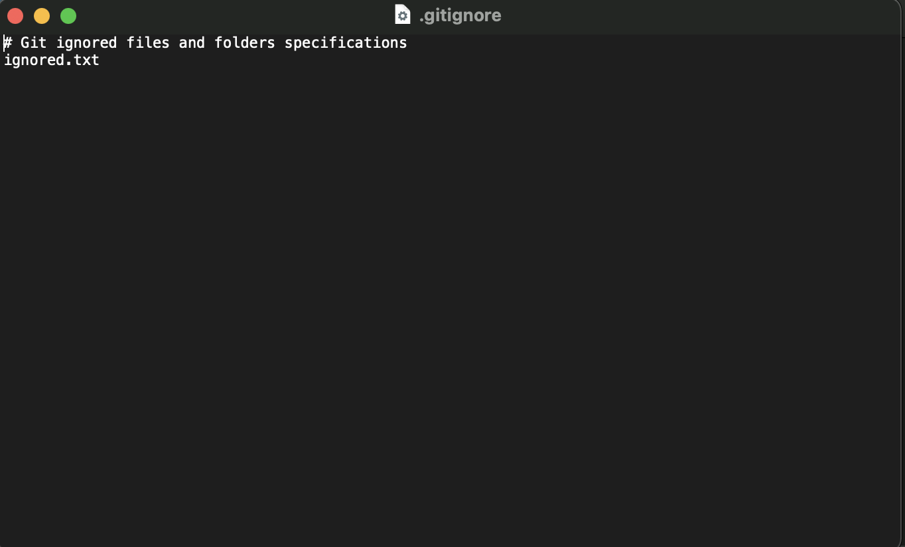

# Lab 4

[RETURN TO HOMEPAGE](https://sierrabakerr.github.io/)

## Lab goals and outcomes:

Part 1: Create initial Fastify Node.js web server

Part 2: Initialize as a Node.js project folder using Node Package Manager (npm)

Part 3: Add Fastify to project using npm, and test using Visual Studio Code (VSCode)

Part 4: Add git repo, exclude node_modules folder from git, make commits

Part 5: Fix MIME error, test, and commit

Part 6: Add a second route with query parameters, test, and commit

## Lab Deliverables:
lab-04.js
package.json
.gitignore
### 1. lab-04.js
[lab-04.js](lab-04.js)

### 2. package.json
[package.json](package.json)

### 3. .gitignore (screenshot)

